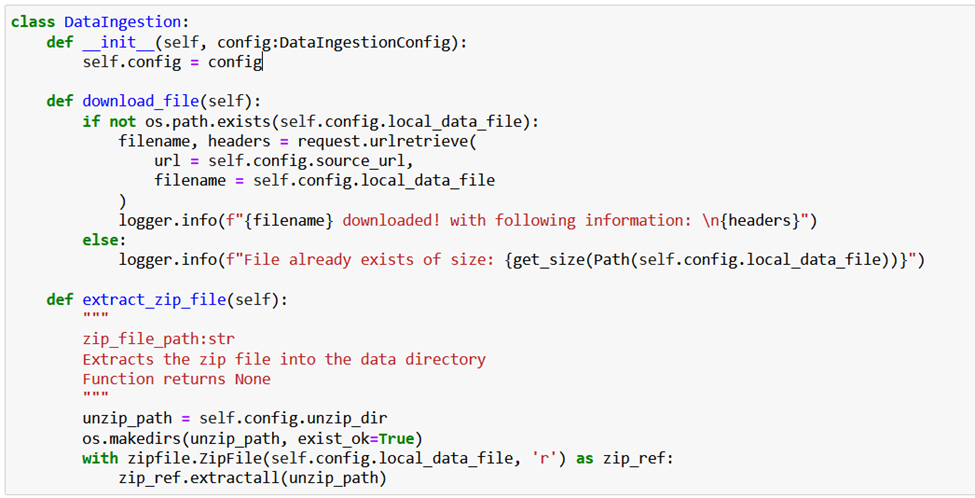

# Chicken-Disease-Classification

Notebook Research 
Step 1: Create Entity  Define a class which contains the configuration objects, this class will be of type @dataclass. 
Save these entities inside config_entity.py under entities folder. 

Step 2: Create Configuration class  this class returns configuration of type entity (defined in step 1). 
This configuration can be used later to retrieve values of configurations.  
Save these configuration inside configuration.py under config folder. 

Step 3: Create Action Class (Data Ingestion / Prepare Base Model etc) this class performs the actual task and 
used configuration as an input argument. 
Define this class inside components folder under a separate file (data_ingestion.py / prepare_base_model.py)

Step 4: Create Pipeline code this logic puts things in actions by calling everything in sequence. Put this action inside pipeline folder inside a new file (e.g stage_01_data_ingestion.py, stage_02_prepare_base_model.py). Create a class of the action like (DataIngestionTrainingPipeline/ PrepareBaseModelTrainingPipeline) and define the below steps inside the main function of this class. 
E.g 
1.  Define configuration object [config = ConfigurationManager()]
2.  Use this object to get the configuration of entity type [data_ingestion_config = config.get_data_ingestion_config()]
3.  Define main action class, and pass this entity configuration object [data_ingestion = DataIngestion(config=data_ingestion_config)]
4.  Perform action action required [data_ingestion.download_file(), data_ingestion.extract_zip_file()]

5.  Step 5: Main class  define main to call multiple pipelines like below. 
STAGE_NAME = "Data Ingestion Stage"

try:
    logger.info(f">>>>>>> stage {STAGE_NAME} started <<<<<<")
    obj = DataIngestionTrainingPipeline()
    obj.main()
    logger.info(f">>>>>>> stage {STAGE_NAME} completed <<<<<\n<<<")
except Exception as e:
    logger.exception(e)
    raise e

STAGE_NAME = "Prepare Base Model"

try:
    logger.info(f">>>>>>> stage {STAGE_NAME} started <<<<<<")
    obj = PrepareBaseModelTrainingPipeline()
    obj.main()
    logger.info(f">>>>>>> stage {STAGE_NAME} completed <<<<<\n<<<")
except Exception as e:
    logger.exception(e)
    raise e

